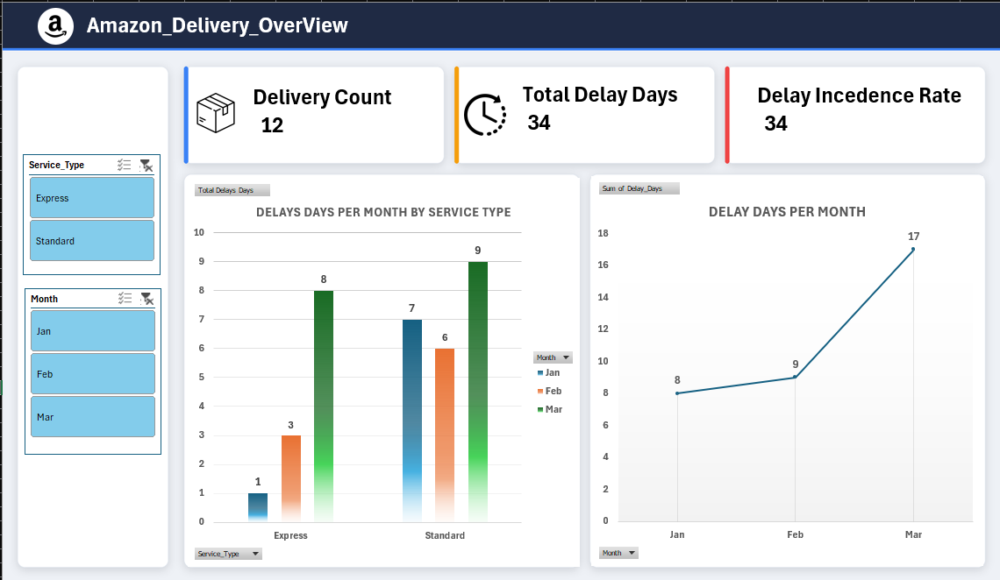
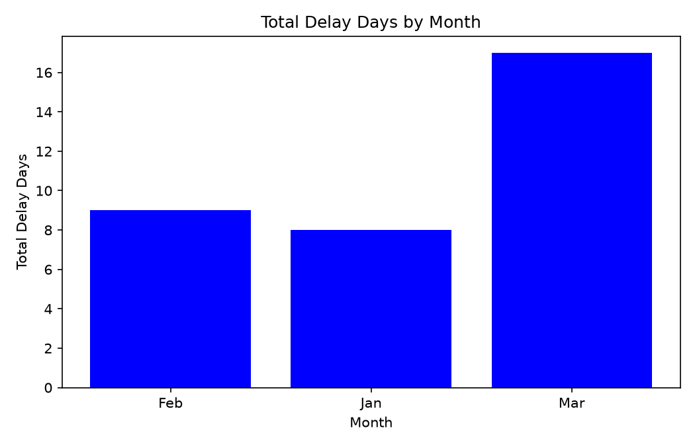

<div align="center">

# 🚚 Amazon Delivery Delay Analyzer
### *Amazon Delivery Delay Analysis Across Excel, SQL & Python*


</div>

---

<div align="center">

# 👤 Author

## Donga Tirth (GR-ID: 13216)

**Amazon Delivery Delay Analyzer – Excel · SQL · Python Data Analysis Project**

**Assigned Set:** Set A

</div>

---

# 📋 Table of Contents

- [📌 Overview](#-overview)
- [🎯 Business Objective](#-business-objective)
- [✨ Project Features](#-project-features)
- [🏗️ Project Structure](#️-project-structure)
- [🗂️ Dataset](#️-dataset)
- [🧹 Data Cleaning & Metric Definitions](#-data-cleaning--metric-definitions)
- [📗 Module 1 — Excel](#-module-1--excel)
- [🗄️ Module 2 — SQL](#️-module-2--sql)
- [🐍 Module 3 — Python](#-module-3--python)
- [📈 Key Findings](#-key-findings)
- [🔁 Cross-Tool Reconciliation](#-cross-tool-reconciliation)
- [🛠️ Tools & Versions](#️-tools--versions)
- [▶️ How to Run](#️-how-to-run)
- [🎥 Working Video](#-working-video)
- [📚 References](#-references)
- [📈 Learning Outcomes](#-learning-outcomes)
- [👤 Author](#-author)

---

# 📌 Overview

**Amazon Delivery Delay Analyzer** is a data analysis project that examines delivery delays across routes, hubs, service types, and months.

The project uses the same cleaned delivery dataset across multiple analytical tools so that the results can be compared and validated.

### Tools covered

- 📗 **Excel** — cleaning, formulas, summaries, PivotTable and dashboard
- 🗄️ **MySQL** — relational tables and analytical SQL queries
- 🐍 **Python** — cleaning, merging, calculations, summary and visualization
- 📊 **Power BI** — dashboard/report section reserved for the final Power BI analysis

> **Note:** The supplied ZIP contains Excel, SQL and Python files. A `.pbix` Power BI file is not included in the supplied ZIP, so Power BI-specific results and four-tool reconciliation should be updated after the Power BI report is added.

---

# 🎯 Business Objective

The objective is to analyze delivery delays and identify the service types, routes and hubs contributing most to the total delay.

## Business Questions

1. **Which service type has the greatest total delivery-delay burden — Express or Standard?**
2. **Which hubs and routes contribute the highest accumulated delivery delay and therefore require process review?**

---

# ✨ Project Features

- 🧹 Duplicate detection and removal
- 🔗 Route lookup enrichment using `route_id`
- ⏱️ Calculation of `delay_days`
- 📦 Service-type delay analysis
- 🌎 Hub-level delay analysis
- 🛣️ Route-level delay analysis
- 📅 Monthly delay trend analysis
- 📈 Delay incidence rate calculation
- 📊 Excel PivotTable and dashboard analysis
- 🗄️ SQL aggregation using `JOIN`, `GROUP BY`, `HAVING` and `LIMIT`
- 🐍 Python analysis using Pandas and Matplotlib
- 🔁 Cross-tool comparison of analytical totals

---

# 🏗️ Project Structure

```text
📦 Amazon_Delivery_Analysis
│
├── 📗 Excel/
│   └── Amazon_Delivery_Analysis.xlsx
│
├── 🐍 Python/
│   └── analysis.ipynb
│
├── 🗄️ SQL/
│   ├── setup.sql
│   └── queries.sql
│
├── 📂 Raw_Data/
│   ├── deliveries.csv
│   └── routes.csv
│
└── 📤 Output/
    ├── clean_data.csv
    ├── python_summary.csv
    ├── python_chart.png
    ├── Excel_Dashboard.png
    └── SQL/
        ├── s2a_delay_by_service_type.csv
        ├── S2b Routes with significant delay.csv
        └── S2c Top two hubs by delay.csv
```

---

# 🗂️ Dataset

## `Raw_Data/deliveries.csv`

The raw delivery fact file contains **13 rows**, including one exact duplicate.

| Column | Type | Meaning |
|---|---|---|
| `record_id` | Integer | Unique delivery record identifier |
| `month` | Text | Delivery month: Jan, Feb or Mar |
| `route_id` | Text | Route identifier linked to `routes.csv` |
| `hub` | Text | Delivery hub |
| `promised_days` | Integer | Promised delivery duration in days |
| `actual_days` | Integer | Actual delivery duration in days |

## `Raw_Data/routes.csv`

The route lookup file contains **4 route records**.

| Column | Type | Meaning |
|---|---|---|
| `route_id` | Text | Primary route identifier |
| `route` | Text | Route name |
| `service_type` | Text | Express or Standard |

---

# 🧹 Data Cleaning & Metric Definitions

## Cleaning Steps

1. Load `deliveries.csv` and `routes.csv`.
2. Check the numeric fields `promised_days` and `actual_days`.
3. Detect the exact duplicate delivery record.
4. Remove the duplicate, reducing the dataset from **13 rows to 12 clean rows**.
5. Merge delivery data with the route lookup using `route_id`.
6. Add `route` and `service_type` to the cleaned dataset.
7. Calculate the delivery-delay metric.
8. Use the cleaned dataset for Excel, SQL and Python analysis.

## Delay Days Formula

```text
delay_days = MAX(actual_days - promised_days, 0)
```

A delivery that is on time or early therefore has `0` delay days.

## Delay Incidence Rate Formula

```text
delay incidence rate =
(number of records where actual_days > promised_days / total records) × 100
```

The calculation is based on underlying record counts rather than averaging subgroup percentages.

---

# 📗 Module 1 — Excel

### File

`Excel/Amazon_Delivery_Analysis.xlsx`

The workbook contains the following sheets:

| Sheet | Purpose |
|---|---|
| **Raw** | Original delivery dataset including the duplicate |
| **Lookup** | Route and service-type lookup table |
| **Clean** | Deduplicated data with `Service_Type`, `Delay_Days` and `Route` |
| **Summary** | Hub-level delay summary and monthly/service-type summary |
| **Dashboard** | Visual summary of the delivery-delay analysis |

### Excel Functions Used

```excel
INDEX()
MATCH()
SUMIF()
MAX()
COUNT()
```

### 📸 Excel Dashboard Screenshot



---

# 🗄️ Module 2 — SQL

### Files

- `SQL/setup.sql`
- `SQL/queries.sql`

## `setup.sql`

Creates the `amazon_delivery` database and the following tables:

- `routes`
- `deliveries`

The `deliveries.route_id` column is connected to `routes.route_id` through a foreign key.

The script inserts the 4 route records and 12 cleaned delivery records.

## `queries.sql`

The project contains three analytical queries:

### S2a — Total Delay by Service Type

Calculates total `delay_days` for each service type and sorts the result in descending order.

### S2b — Routes with Significant Delay

Identifies routes whose total accumulated delay is greater than **8 days**.

### S2c — Top Two Hubs by Delay

Ranks hubs by total accumulated delay and returns the top two hubs.

---

## SQL Run Order

Run `setup.sql` first, followed by `queries.sql`.

```bash
mysql -u <user> -p < SQL/setup.sql
mysql -u <user> -p < SQL/queries.sql
```

---

# 🐍 Module 3 — Python

### File

`Python/analysis.ipynb`

The Python notebook uses **Pandas** and **Matplotlib**.

## Python Analysis Steps

1. Load `deliveries.csv` and `routes.csv`.
2. Convert `promised_days` and `actual_days` to numeric values.
3. Remove the exact duplicate row.
4. Merge delivery data with route information using `route_id`.
5. Calculate `delay_days`.
6. Group the data by `service_type`.
7. Calculate total delay and delay incidence rate.
8. Identify the route with the greatest accumulated delay.
9. Calculate monthly total delay.
10. Export the cleaned data and summary files.
11. Generate the monthly delay chart.

### Python Outputs

- `Output/clean_data.csv`
- `Output/python_summary.csv`
- `Output/python_chart.png`

### 📸 Python Chart Screenshot



---


# 📈 Key Findings

The cleaned dataset contains **12 delivery records** and **34 total delay days**.

| Metric | Finding |
|---|---:|
| Total delay days | **34 days** |
| Express total delay | **12 days** |
| Standard total delay | **22 days** |
| Express delay incidence rate | **66.67%** |
| Standard delay incidence rate | **83.33%** |
| Highest-delay route | **R4 — 14 days** |
| Second-highest route | **R1 — 9 days** |
| Highest-delay hub | **Mumbai — 15 days** |
| Second-highest hub | **Delhi — 14 days** |
| Overall delay incidence rate | **75.00%** |
| Highest-delay month | **March — 17 days** |

## Two Numeric Findings

1. **Standard service recorded 22 total delay days**, compared with **12 days for Express**.
2. **Route R4 recorded 14 delay days**, representing approximately **41.18% of the total 34 delay days**.

## Recommendation

Based on the analyzed dataset, the analysis indicates that **R4 and the Mumbai hub should be reviewed first for delivery-delay causes and process improvement**, because they account for the highest accumulated delay in the supplied data.

> **Limitation:** The dataset contains only 12 unique records across three months. These findings should therefore be treated as directional and validated with a larger operational dataset.

---

# 🔁 Cross-Tool Reconciliation

A key validation metric is:

```text
Standard service total delay = 22 days
```

This value is available in:

- **Excel** — Summary/PivotTable analysis
- **SQL** — S2a service-type query
- **Python** — `python_summary.csv`

### Power BI Reconciliation

The supplied ZIP does **not** contain a Power BI `.pbix` file, so a four-tool reconciliation cannot be verified from the supplied project files.

After adding the Power BI report, confirm that:

```text
Excel   = 22 days
SQL     = 22 days
Python  = 22 days
Power BI = 22 days
```

**Rounding note:** The total delay value is an integer, so no rounding difference is expected.

---

# 🛠️ Tools & Versions

| Tool | Purpose | Version |
|---|---|---|
| **Microsoft Excel** | Cleaning, formulas, summaries, PivotTable and dashboard | Not documented in project files |
| **MySQL** | Database creation and SQL analysis | Not documented in project files |
| **Python** | Data cleaning and analysis | Not documented in project files |
| **Pandas** | Data manipulation and aggregation | Not documented in project files |
| **Matplotlib** | Data visualization | Not documented in project files |
| **Power BI** | Dashboard/reporting | `.pbix` not included in supplied ZIP |

> **Note:** The project files do not contain a `requirements.txt` or explicit software-version record. Exact versions should be added here if required by the submission.

---

# ▶️ How to Run

## Excel

Open:

```text
Excel/Amazon_Delivery_Analysis.xlsx
```

The workbook contains the raw data, lookup table, cleaned data, summaries and dashboard.

## SQL

From the repository root:

```bash
mysql -u <user> -p < SQL/setup.sql
mysql -u <user> -p < SQL/queries.sql
```

Run `setup.sql` before `queries.sql`.

## Python

Install the required packages:

```bash
pip install pandas matplotlib 
```

Then open:

```text
Python/analysis.ipynb
```

Run the notebook from the repository/project root.

> **Important:** The supplied notebook currently contains local absolute file paths. If you run it on another computer, update the `Raw_Data` and `Output` paths to match your local project location.

## Power BI

If the `.pbix` file is added:

1. Open the report.
2. Update the CSV source path.
3. Refresh the dataset.
4. Verify the dashboard totals against the other tools.

---

# 🎥 Working Video

**Video URL:** `[ADD WORKING VIDEO URL HERE]`

**Duration:** `[ADD VIDEO DURATION HERE]`

---

# 📚 References

- Supplied project dataset: `Raw_Data/deliveries.csv`
- Supplied route lookup dataset: `Raw_Data/routes.csv`
- Microsoft Excel documentation, if external Excel functions were referenced
- MySQL documentation, if external SQL syntax was referenced
- Pandas documentation, if external Python functionality was referenced
- Matplotlib documentation, if external plotting functionality was referenced

> If no external code or resources were used, state: **"No external code or resources were used."**

---

# 📈 Learning Outcomes

- ✅ Clean and deduplicate raw delivery data
- ✅ Enrich data using a lookup table
- ✅ Calculate delivery-delay metrics
- ✅ Calculate delay incidence rate
- ✅ Analyze delays by service type, route, hub and month
- ✅ Use Excel formulas and PivotTables
- ✅ Create relational tables in MySQL
- ✅ Write SQL `JOIN`, `GROUP BY`, `HAVING` and `LIMIT` queries
- ✅ Use Pandas for data cleaning and aggregation
- ✅ Create charts using Matplotlib
- ✅ Export analysis results to CSV
- ✅ Compare results across different analytical tools

---

# 👤 Author

**Donga Tirth**  
**GR-ID: 13216**  
**Assigned Set: Set A**

---

<div align="center">

### ⭐ Thank You For Visiting This Project ⭐

</div>
